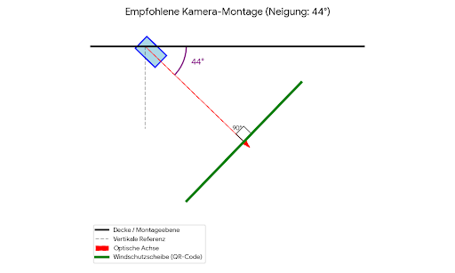

# Projektdokumentation: QR-Code-Erkennung und Winkelbestimmung in Waschanlagen

**Modul:** VdKI (Verarbeitung digitaler Kulturinhalte / Bildverarbeitung)  
**Semester:** WS 25/26  
**Team:** [Namen der Teammitglieder einfügen]  

---

## 1. Einleitung und Aufgabenstellung

Ziel dieses Projektes war die Entwicklung eines robusten Computer-Vision-Systems für den Einsatz in einer Waschanlage. Das System muss in der Lage sein, QR-Codes auf Zetteln hinter der Windschutzscheibe von Fahrzeugen zuverlässig zu erkennen und deren Orientierung (Winkel) relativ zur Kamera zu bestimmen.

**Herausforderungen:**
* **Variable Umweltbedingungen:** Nasse, seifige oder dreckige Scheiben, die die Sicht behindern.
* **Störobjekte:** Andere Zettel, Objekte im Innenraum, Spiegelungen auf der Scheibe.
* **Distanz:** Erkennung aus bis zu 3 Metern Entfernung.
* **Kameramontage:** Ermittlung des optimalen Montagewinkels basierend auf einer statistischen Analyse realer Testdaten.

Das Projekt gliedert sich in zwei aufeinanderfolgende Hauptkomponenten:
1.  **Detektion (CNN & Heatmap):** Ein Convolutional Neural Network klassifiziert Bildausschnitte (Patches), um die Position des QR-Codes mittels einer Wahrscheinlichkeits-Heatmap zu lokalisieren.
2.  **Gezielte Decodierung & Analyse:** Ein KI-gestützter Decoder (QReader) wird gezielt auf die detektierten Bereiche angewandt, liest den Code und berechnet den Neigungswinkel zur Optimierung der Kameraausrichtung.

---

## 2. Datengrundlage und Vorverarbeitung

### 2.1. Datenerhebung und Patch-Strategie
Die Datengrundlage bilden Bilder aus verschiedenen Szenarien in der Waschanlage sowie synthetisch generierte Daten. 
Wir haben uns entschieden, das Modell nicht auf das gesamte, hochauflösende Eingangsbild zu trainieren, sondern auf kleinere Bildausschnitte (**Patches**), die mittels **Sliding Windows** unterschiedlicher Größen generiert wurden.

**Begründung:** Das Trainieren auf dem Gesamtbild erwies sich als unsicher, da die Vielzahl an Hintergrundobjekten (Lenkrad, Sitze, andere Aufkleber) im Verhältnis zum relativ kleinen QR-Code das Signal-Rausch-Verhältnis ungünstig beeinflusste. Ein Patch-basierter Ansatz zwingt das Modell, lokale Merkmale (Texturen, Finder Patterns) zu lernen.

### 2.2. Labeling-Strategie ("Die 3-Regeln-Logik")
Zur Datengenerierung wurden die Bilder durch Sliding Window in Patches zerschnitten und anschließend in die Klassen "QR-Code" und "Kein QR-Code" unterteilt. Um die Qualität des Datensatzes zu maximieren und Label Noise zu vermeiden, wurde ein Patch nur dann als positiv gelabelt, wenn er **alle** folgenden drei Regeln erfüllte:

1.  **Abdeckung:** Mindestens ca. **30%** des QR-Codes müssen im Patch enthalten sein.
2.  **Geometrische Anker:** Mindestens **eines der großen Quadrate** (Finder Patterns) in den Ecken des Codes muss im Patch liegen.
3.  **Visuelle Validierung:** Mindestens eins dieser größeren Quadrate muss für das menschliche Auge klar als solches identifizierbar sein (Schärfe/Kontrast).

**Qualitätssicherung:** Wenn ein Patch zwar einen Teil eines QR-Codes enthielt, diese strengen Regeln jedoch nicht erfüllte (z.B. nur unstrukturierte Datenpixel ohne Finder Pattern), wurde der Patch komplett aus dem Datensatz gelöscht, anstatt ihn als Negativbeispiel zu nutzen. Dies verhindert, dass das Modell widersprüchliche Informationen lernt.

### 2.3. Datensatz-Statistik
* **Training Positiv:** 20.000 Patches (Der Bestand an echten QR-Code-Ausschnitten wurde durch synthetische Bilder auf diese Zahl aufgefüllt).
* **Training Negativ:** 20.000 Patches (Hintergründe, Windschutzscheiben, Störobjekte).
* **Gesamt:** 40.000 Trainingsdaten.

### 2.4. Daten-Augmentierung
Da ich nicht genau weiß, welche Augmentierung im Detail lief, setze ich hier einen Platzhalter. Generell wurde `ImageDataGenerator` genutzt, um Variationen zu erzeugen.
*[Platzhalter: Hier können spezifische Augmentierungsmethoden eingefügt werden, z.B. Rotation, Helligkeitsschwankungen, Zoom, um Nässe/Dreck zu simulieren.]*

---

## 3. Modellarchitektur (CNN)

Es wurde ein **Convolutional Neural Network (CNN)** von Grund auf trainiert (kein Transfer Learning), um die binäre Klassifikation auf den Patches durchzuführen. Das Modell extrahiert hierarchische Merkmale – von einfachen Kanten der Finder Patterns bis hin zur Textur der Datenmatrix – und gibt eine Wahrscheinlichkeit $P(y=QR|x)$ aus.

---

## 4. Inferenzprozess und Heatmap-Generierung

Ein zentraler Bestandteil unseres Ansatzes ist die Art und Weise, wie die lokalen Vorhersagen des CNNs zu einer globalen Entscheidung (Lokalisierung im Gesamtbild) zusammengeführt werden. Dies geschieht über die Erstellung einer **Probability Heatmap**.

### 4.1. Sliding Window Inferenz
Im Anwendungsfall (Inferenz) wird ein Fenster (Sliding Window) über das zu analysierende Gesamtbild geschoben. Für jede Position dieses Fensters berechnet das CNN die Wahrscheinlichkeit, ob der Ausschnitt einen QR-Code enthält.

### 4.2. Aufbau der Heatmap (Akkumulation und Thresholding)
Die Heatmap entsteht nicht durch einfaches Ersetzen von Pixelwerten, sondern durch ein additives Verfahren unter Berücksichtigung eines Konfidenz-Schwellenwertes (Thresholding):

1.  **Schwellenwert-Filterung:** Um das Rauschen ("Noise") durch unsichere Vorhersagen zu minimieren, werden nur Vorhersagen berücksichtigt, deren Wahrscheinlichkeit einen definierten Schwellenwert $x$ überschreitet (z.B. $P > 0.5$ oder höher). Vorhersagen unter diesem Wert werden als irrelevanter Hintergrund verworfen.
    
2.  **Pixelweise Aufsummierung:** Wenn ein Patch den Schwellenwert überschreitet, wird dessen Wahrscheinlichkeitswert auf die entsprechenden Pixelkoordinaten einer leeren Matrix (der Heatmap) **aufaddiert**.
    
    * *Mathematisch:* Für jeden Pixel $(i, j)$ im Bereich des aktuellen Fensters $W$ gilt:
        $$Heatmap(i, j) = Heatmap(i, j) + P(Patch)$$
        *(unter der Bedingung $P(Patch) > x$)*

**Effekt dieser Methode:**
Durch das Überlappen der Sliding Windows (Overlapping) werden Pixel, die tatsächlich zu einem QR-Code gehören, mehrfach von verschiedenen Fenstern abgedeckt. Da bei jedem "Treffer" der Wert addiert wird, entstehen an der Position des QR-Codes extrem hohe Werte ("Hotspots"). Einzelne Fehldetektionen (False Positives) an anderen Stellen im Bild summieren sich hingegen kaum auf und bleiben in der Heatmap schwach. Dies führt zu einer sehr robusten Lokalisierung des QR-Codes, selbst wenn das Bild ansonsten "unruhig" ist.

---

## 5. Gezielte Decodierung (ROI-Extraction)

Ein wesentliches Merkmal unserer Pipeline ist, dass der eigentliche Decodier-Algorithmus (QReader) **nicht** blind auf das gesamte Bild angewendet wird. Dies spart Rechenzeit und reduziert Fehler durch Störtexte im Hintergrund.

### 5.1. Extraktion der Region of Interest (ROI)
Aus der in Schritt 4 erzeugten Heatmap wird der Bereich mit der höchsten Aktivierung ermittelt.
1.  Die Heatmap wird normalisiert und binarisiert (Hotspots werden weiß, Rest schwarz).
2.  Es werden die Konturen um die weißen Bereiche gezogen.
3.  Das umschließende Rechteck (Bounding Box) dieser Kontur definiert das **QR-Code-Fenster**.

### 5.2. Anwendung des Decoders
Nur dieser ausgeschnittene Bildbereich (der ROI) wird an den Decoder übergeben. 
Das bedeutet: **Das Entcoden des QR-Codes wird ausschließlich auf das durch die Heatmap gefundene Fenster angewendet.**
Dies stellt sicher, dass der Decoder mit einem Bildausschnitt arbeitet, in dem der QR-Code formatfüllend und dominant ist, was die Erfolgsrate der KI-basierten Lesemethode signifikant erhöht.

---

## 6. Vergleich der Decodierungs-Methoden

Für den Schritt des Auslesens (Decoding) innerhalb der gefundenen ROI wurden drei Methoden evaluiert:

1.  **OpenCV (`cv2.QRCodeDetector`):**
    * *Theorie:* Klassische Computer-Vision-Algorithmen (Kantenerkennung, Finder Patterns).
    * *Bewertung:* Schnell, aber anfällig bei Verzerrung und schlechtem Kontrast (typisch für Waschanlagen).

2.  **Pyzbar (ZBar):**
    * *Theorie:* Zeilenweises Scannen nach Barcode-Mustern.
    * *Bewertung:* Robuster als OpenCV, aber Probleme bei starken perspektivischen Verzerrungen.

3.  **QReader (KI-basiert) [Final gewählt]:**
    * *Theorie:* Diese Bibliothek nutzt im Hintergrund ein eigenes Objekterkennungs-Modell (oft YOLO-basiert) und fortschrittliche Super-Resolution-Techniken, um QR-Codes auch in schwierigen Situationen zu rekonstruieren.
    * *Ergebnis:* QReader erwies sich als die überlegene Methode. Sie konnte die meisten Codes entschlüsseln, insbesondere solche, die durch die Kameraposition stark geneigt oder leicht unscharf waren.

---

## 7. Analyse der Kamera-Ausrichtung (Winkelbestimmung)

Nach der erfolgreichen Detektion und Decodierung durch `QReader` wurde die geometrische Verzerrung des QR-Codes genutzt, um den Winkel der Kamera relativ zur Windschutzscheibe zu berechnen. Dies basiert auf der Homographie-Transformation der vier Eckpunkte des QR-Codes.

### 7.1. Ergebnisse der Winkel-Analyse
Die Analyse wurde auf dem gesamten Bildbestand (**4022 Bilder**) durchgeführt. Davon konnten **1075 QR-Codes** erfolgreich decodiert und geometrisch ausgewertet werden.

Die statistische Auswertung ergab folgende Werte:

* **Minimaler Winkel:** $0.0^\circ$ (Frontale Aufnahme)
* **Maximaler Winkel:** $68.2^\circ$ (Extrem flache Aufnahme)
* **Durchschnitt (Mean):** $39.5^\circ$
* **Median (Robust):** $44.3^\circ$

**Interpretation:** Der Median ($44.3^\circ$) wird hier als der repräsentative Wert gewählt, da er im Gegensatz zum Durchschnittswert robuster gegenüber Ausreißern ist, die durch fehlerhafte Eckpunkt-Erkennung entstehen können.

---

## 8. Finale Montage-Empfehlung

Basierend auf der Analyse der vorliegenden Bilder ergibt sich folgende Empfehlung für die Installation der Kamera in der Waschanlage:


```text
============================================================
             FINALE EMPFEHLUNG FÜR KAMERA-MONTAGE
============================================================
💡 EMPFEHLUNG:
   Um die Kamera optimal auszurichten (plan zur Oberfläche der 
   Windschutzscheibe in den häufigsten Positionen), sollte sie 
   um ca. 44° geschwenkt werden.

   (Idealer Einstellbereich: 27° bis 61°)
============================================================
```

<p align="center">
  
  <br>
  <em>Abbildung 1: Schematische Darstellung der empfohlenen Kamera-Montage (44° Neigung zur Horizontalen)</em>
</p>